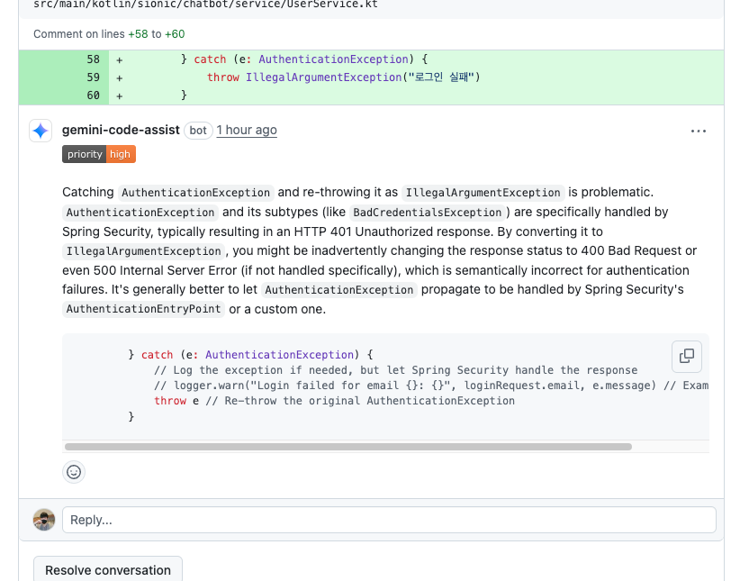

## MVP
1. 회원가입, 로그인 구현
   - JWT 인증
   - Spring Security
   - 기능에 관리자 권한 분리 필요
2. 기본 대화(Chat) 기능 구현
    - 스레드 -> DB단
    - 대화 생성, 스레드 단위, 정렬, 페이지네이션, 삭제
3. 피드백
    - 특정 대화에 대한 피드백
    - 피드백 생성, 목록 조회, 정렬, 페이지네이션, 필터링
4. 분석 및 보고 기능
    - 기록 저장
    - csv

## To-Be
- 사용자 ID(string)?? -> UUID
- 스트림 응답...?
- 글로벌 예외 핸들러
- QueryDSL -> 있어야할꺼 같음

## Gemini 코드리뷰
- 로그인 실패 인증 처리 변경

- @Valid 추가하기
