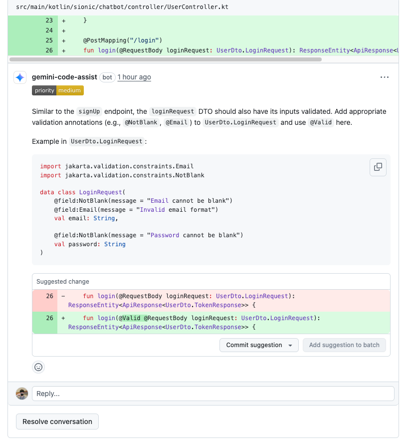

# 과제 문서
### 1. 과제 분석 과정
- 사전 과제 문서에 명시된 요구사항을 면밀히 검토하여 MVP(Minimum Viable Product) 개발 범위를 설정하고, 이를 바탕으로 핵심 기능들을 우선적으로 정의했습니다.
- 개발을 진행하는 동안 추가적으로 고려할 만한 개선점이나 아이디어가 도출될 경우, 이를 별도로 기록하여 향후 시스템 고도화를 위한 자료로 활용할 수 있도록 준비했습니다.
- Stream 기능 요구사항에 대해서는, 문맥상 OpenAI API와의 실시간 양방향 통신보다는 생성되는 응답을 순차적으로 전달하는 SSE(Server-Sent Events) 방식 
또는 유사한 스트림 형태로 해석했습니다. 
- 다만, 안정적인 스트림 처리 구현에는 충분한 시간과 자원 검토가 필요하다고 판단하여, 해당 기능은 다른 핵심 기능 구현 이후로 우선순위를 조정하였습니다.

### 2. 과제 진행 중 AI 활용
- 이번 과제 수행에는 주로 Gemini 2.5 Pro를 활용하여 코드 컨설팅, 특정 로직 구현 아이디어 탐색, 그리고 작성한 코드에 대한 리뷰 등 개발 과정 전반에 걸쳐 도움을 받았습니다.
- 최근 Gemini를 구독하게 된 계기는 향상된 코드 리뷰 기능과 더불어 NotebookLM과 같은 새로운 생산성 도구에 대한 개인적인 관심 때문이었으며, 이번 과제를 통해 Gemini의 다양한 기능을 실제 개발에 적용해 볼 수 있었습니다.
- AI 도구 활용 과정에서 특별한 어려움은 없었으나, 코드 리뷰 후 수정을 할만한 시간이 부족하였습니다.

### 3. 어려웠던 기능 (또는 고민되었던 부분)
- 이전 프로젝트에서 SSE(Server-Sent Events)를 이용한 실시간 스트리밍 기능을 개발하며 메모리 부족 및 연결 관리의 어려움을 겪었던 경험이 있습니다. 
- 당시 해당 문제를 완벽하게 해결하지 못했던 기억 때문에, 이번 과제의 Stream 관련 요구사항을 처음 접했을 때 안정적인 구현 방안에 대해 다소 신중하게 고민하는 시간이 필요했습니다.
- 결국 시간부족으로 구현하지 못하였습니다.

## MVP
1. 회원가입, 로그인 구현
   - JWT 인증
   - Spring Security
   - 기능에 관리자 권한 분리 필요
2. 기본 대화(Chat) 기능 구현
    - 스레드 -> DB단
    - 대화 생성, 스레드 단위, 정렬, 페이지네이션, 삭제
3. 피드백
    - 특정 대화에 대한 피드백
    - 피드백 생성, 목록 조회, 정렬, 페이지네이션, 필터링
4. 분석 및 보고 기능
    - 기록 저장
    - csv

## To-Be
- 사용자 ID(string)?? -> UUID
- 스트림 응답...?
- 글로벌 예외 핸들러
- QueryDSL -> 있어야할꺼 같음

## Gemini 코드리뷰
- 로그인 실패 인증 처리 변경

- @Valid 추가하기
